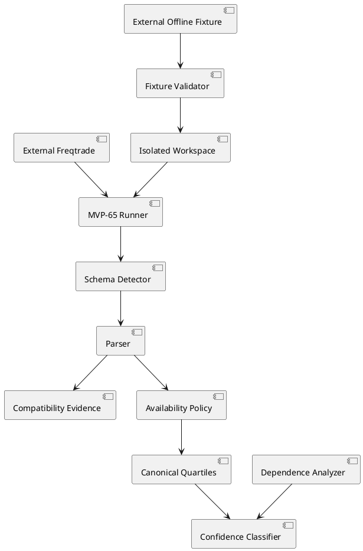

# SPEC-072 — Real Freqtrade Compatibility and Research Methodology Validation

## Status

**Approved for Phase B implementation.**

- **Spec ID:** SPEC-072
- **Phase:** B — Real Freqtrade Compatibility and Research Methodology Validation
- **Starting version:** `0.70.1-dev`
- **Starting tag:** `v0.70.1-dev` (annotated, `0303dcd`)
- **MVP scope sole subprocess boundary:** MVP-65 (`research_backtest_comparison`)
- **Real compatibility result:** `REAL_FREQTRADE_COMPATIBILITY_NOT_EXECUTED` (external executable + fixture not provided)
- **Final version after methodology closure:** `0.70.2-dev`
- **Final version after real compatibility PASS (deferred):** `0.71.0-rc.1`

## Background

Phase A closed conformance, safety, writer, resume, ledger-integrity, and checkpoint defects at `v0.70.1-dev`.

Phase B closes the remaining completion blockers:

1. Validate MVP-65 against a real external Freqtrade executable and external offline fixture.
2. Align methodology for zero-trade windows, quartiles, constant-delta samples, and overlapping evaluation windows.

The target remains a research-only, deterministic, reproducible, human-auditable quantitative-research framework.

## Requirements

### Must Have

#### Real Freqtrade compatibility

- MVP-65 remains the sole subprocess boundary.
- Permit only executable `--version` validation and `freqtrade backtesting`.
- Require explicit external executable and external fixture paths.
- Reject fixtures under repository `data/` and `reports/`.
- Never download data or access exchanges/networks.
- Materialize the caller-provided strategy into an isolated Freqtrade user-data workspace.
- Preserve original strategy fingerprint and verify no mutation.
- Build a schema-valid Freqtrade backtesting config.
- Keep Hunter-only safety metadata outside the Freqtrade runtime config.
- Use static pair lists and no credentials.
- Execute Candidate then Baseline sequentially.
- Use argument lists, `shell=False`, allowlisted environment, bounded timeout, and bounded output.
- Never retry or parallelize.
- Reject export symlinks and path escapes.
- Discover the actual export deterministically.
- Parse the real nested Freqtrade export format.
- Reject unknown or ambiguous schemas.
- Use configured starting balance for fallback calculations.
- Record Freqtrade version, config/strategy/fixture/result fingerprints, schema ID, and parsed-report fingerprint.
- Never report compatibility unless a real executable was actually run.

Compatibility states:

```text
COMPATIBLE
INCOMPATIBLE
NOT_EXECUTED
BLOCKED_INVALID_FIXTURE
BLOCKED_INVALID_EXECUTABLE
```

#### External fixture

Require a caller-provided manifest containing:

- fixture schema version
- exchange identifier
- trading mode
- timeframe
- pair list
- timerange
- candle-file hashes
- expected strategy class
- provenance note

Never mutate the external fixture.

#### Zero-trade policy

Distinguish:

- valid numeric zero with executed trades
- zero trades
- one-sided zero trades
- insufficient trades
- missing metric
- parser failure

Unavailable/insufficient windows must not enter bootstrap samples by default.

Make minimum trade count explicit and configurable.

Evidence availability states:

```text
AVAILABLE
ZERO_TRADES
INSUFFICIENT_TRADES
ONE_SIDED_ZERO_TRADES
MISSING_METRIC
PARSER_FAILED
BLOCKED
TIMED_OUT
UNSUPPORTED_SCHEMA
```

Only `AVAILABLE` deltas enter default confidence samples.

#### Quartile policy

Use one canonical quartile implementation across:

- research_walk_forward
- research_statistical_confidence

Document empty, singleton, odd, even, repeated-value behavior and include a quartile-policy schema/version in reports.

#### Constant-delta policy

Detect zero observed dispersion.

Do not emit `ROBUST_CANDIDATE` or `ROBUST_BASELINE` solely because a constant non-zero sample produces a point bootstrap interval.

Require explicit distinct-value or dispersion criteria and deterministic reason codes:

- `ZERO_OBSERVED_DISPERSION`
- `INSUFFICIENT_DISTINCT_VALUES`

Classification must remain symmetric.

#### Window dependence

Calculate:

- whether evaluation windows overlap
- overlapping window-pair count
- maximum overlap duration (seconds)
- independence status

Dependence states:

```text
NON_OVERLAPPING
OVERLAPPING
UNKNOWN
```

Default independent-replication claims must exclude overlapping/dependent windows.

Bootstrap output must state its exchangeability assumption.

#### Governance

Preserve:

```text
research_only=True
execution_approval_granted=False
production_approval_granted=False
live_trading_allowed=False
automatic_execution_allowed=False
human_approval_required=True
```

No live/dry-run trading, exchange/network access, data download, scheduler, database, queue, retry, parallelism, automatic selection, composite score, or approval.

No push or remote changes.

Do not inspect or modify repository `data/` or `reports/`.

Do not start MVP-71.

### Won't Have

- Live or dry-run trading
- Exchange connectivity
- Data download
- Hyperopt or optimization
- Paper-trading adapter
- Production adapter
- Block bootstrap unless separately justified
- MVP-71

## Method

### Primary packages

```text
src/hunter/research_backtest_comparison/
src/hunter/research_walk_forward/
src/hunter/research_statistical_confidence/
```

Supporting changes only where required:

```text
src/hunter/research_campaign/
src/hunter/research_evidence_ledger/
```

### Architecture



### Execution flow

1. Validate baseline.
2. Validate executable and run `--version`.
3. Validate fixture manifest and hashes.
4. Create isolated workspace.
5. Materialize strategy and fixture data.
6. Build supported config.
7. Execute Candidate.
8. Discover, validate, and parse Candidate export.
9. Execute Baseline.
10. Discover, validate, and parse Baseline export.
11. Verify immutability.
12. Build compatibility report.
13. Clean workspace only after parsed evidence and fingerprints exist.

### Implementation stages

1. Baseline and official-contract review
2. Fixture and executable contracts
3. Workspace/config/strategy materialization
4. Real export schema detection and parser closure
5. Controlled real Freqtrade compatibility execution
6. Zero-trade/insufficient-evidence policy
7. Canonical quartiles and constant-delta policy
8. Window-overlap/dependence metadata
9. Integration, migration, adversarial, full-suite verification
10. Read-only reviews, docs, version, local release-candidate tag

## Outputs

```text
freqtrade_compatibility_config.json
external_fixture_manifest.json
freqtrade_command_contract.json
freqtrade_compatibility_report.json
freqtrade_compatibility_report.md
methodology_policy.json
methodology_validation_report.json
methodology_validation_report.md
phase_b_manifest.json
```

### Real compatibility result when external inputs are missing

When no explicit external executable and fixture are provided, the system reports exactly:

```text
REAL_FREQTRADE_COMPATIBILITY_NOT_EXECUTED
```

and does not declare full Phase B PASS, and does not create the `v0.71.0-rc.1` tag.

A scoped development patch (`0.70.2-dev`) is justified for the methodology closure work performed in stages 6-8 of this spec.

### Mandatory notice

```text
This artifact is research-only.
Real Freqtrade backtesting compatibility, historical-result parsing,
methodology policies, confidence intervals, and stability labels do not
prove profitability and do not authorize execution, production deployment,
live trading, dry-run trading, automatic execution, strategy selection,
universe selection, order placement, signal generation, strategy mutation,
universe mutation, or position changes.
Human review remains required.
```

## Verification

Completion evidence must include:

- executable validation and Freqtrade version (or explicit `REAL_FREQTRADE_COMPATIBILITY_NOT_EXECUTED`)
- fixture manifest and hashes (or explicit absence)
- actual Candidate/Baseline command contracts (or explicit absence)
- export discovery and schema IDs (or explicit absence)
- parser evidence (synthetic fixtures when real unavailable)
- strategy/config immutability
- zero-trade availability matrix
- quartile vectors
- constant-delta classification evidence
- overlap/dependence evidence
- exact tests and full-suite result
- compatibility state
- no forbidden runtime expansion
- no repository `data/` or `reports/` access
- no push or remote changes

## Need Professional Help in Developing Your Architecture?

Please contact me at [sammuti.com](https://sammuti.com) :)